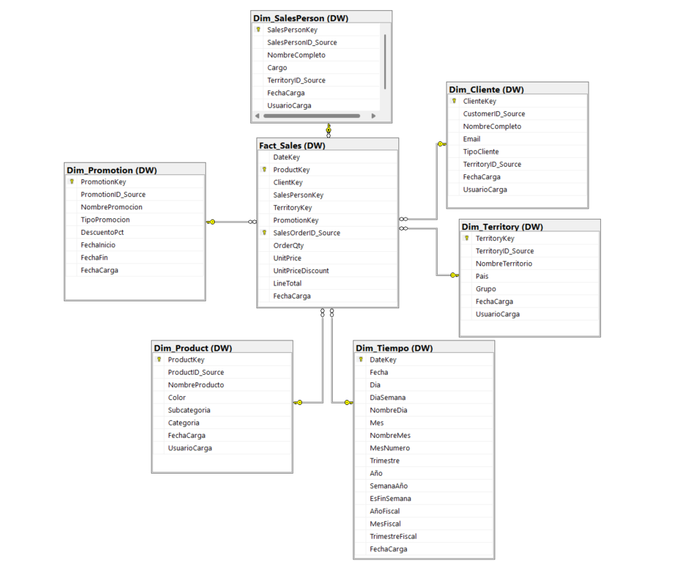
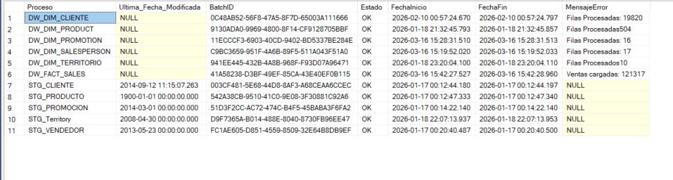
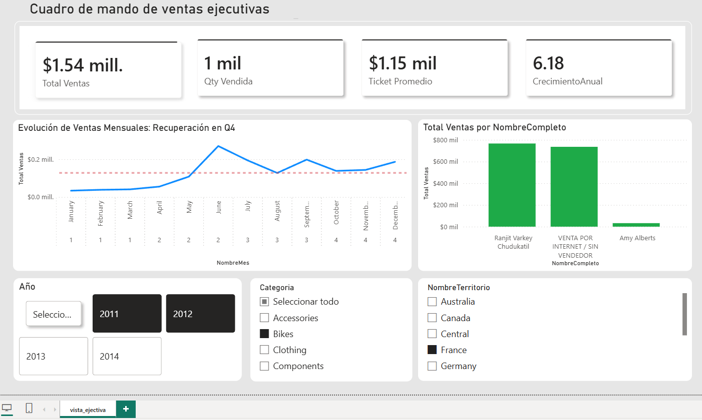

# AdventureWorks Data Warehouse — ETL Incremental con SQL Server y Power BI

> Pipeline de datos end-to-end construido desde cero: extracción incremental desde un OLTP, área de staging con control de cargas, esquema dimensional en estrella y dashboard ejecutivo en Power BI.


---

## Tabla de Contenidos

- [El problema que resuelve](#el-problema-que-resuelve)
- [Arquitectura](#arquitectura)
- [Decisiones de diseño](#decisiones-de-diseño)
- [Problemas encontrados y soluciones](#problemas-encontrados-y-soluciones)
- [Estructura del repositorio](#estructura-del-repositorio)
- [Tecnologías](#tecnologías)
- [Modelo dimensional](#modelo-dimensional)
- [Pipeline ETL](#pipeline-etl)
- [Control de cargas y auditoría](#control-de-cargas-y-auditoría)
- [Dashboard Power BI](#dashboard-power-bi)
- [Orden de ejecución](#orden-de-ejecución)
- [Roadmap](#roadmap)
- [Autor](#autor)

---

## El problema que resuelve

AdventureWorks2019 es una base de datos OLTP normalizada: está diseñada para registrar transacciones rápidamente, no para analizarlas. Obtener un reporte simple de ventas por territorio y categoría requiere entre 6 y 8 JOINs sobre tablas como `Sales.SalesOrderHeader`, `Sales.SalesOrderDetail`, `Production.Product`, `Production.ProductSubcategory`, `Sales.SalesTerritory` y otras.

Ese modelo no escala para análisis. A medida que crecen los datos, las consultas analíticas sobre un OLTP se vuelven lentas, bloquean transacciones productivas y son difíciles de mantener.

**Este proyecto resuelve eso construyendo una capa analítica separada**: un Data Warehouse con esquema en estrella donde cualquier análisis de ventas se puede hacer con un JOIN simple entre `Fact_Sales` y la dimensión correspondiente.

---

## Arquitectura




## FLUJO DE OPERACION 

```
┌──────────────────────────────────────────────────────────────┐
│                  AdventureWorks2019 (OLTP)                   │
│        Sales · Production · Person · HumanResources          │
└────────────────────────────┬─────────────────────────────────┘
                             │  Extracción incremental
                             │  WHERE ModifiedDate > @Watermark
                             ▼
┌──────────────────────────────────────────────────────────────┐
│              AventureWorks_DWH · Esquema STG                 │
│                                                              │
│   STG.Cliente · STG.Producto · STG.Vendedor                  │
│   STG.Territory · STG.Promocion                              │
│                                                              │
│   ETL.Control_Carga → Watermark + BatchID + Estado          │
└────────────────────────────┬─────────────────────────────────┘
                             │  MERGE (SCD Tipo 1)
                             │  INSERT nuevos / UPDATE cambios
                             ▼
┌──────────────────────────────────────────────────────────────┐
│              AventureWorks_DWH · Esquema DW                  │
│                                                              │
│  Dim_Tiempo ────────────────────────────────┐               │
│  Dim_Product ───────────────────────────────│               │
│  Dim_Cliente ───────────────────────────────┤─ Fact_Sales   │
│  Dim_SalesPerson ───────────────────────────│               │
│  Dim_Territory ─────────────────────────────│               │
│  Dim_Promotion ─────────────────────────────┘               │
└────────────────────────────┬─────────────────────────────────┘
                             │  Import Mode (SQL Server)
                             ▼
┌──────────────────────────────────────────────────────────────┐
│                   Power BI Dashboard                         │
│   Ventas por período · Por territorio · Por vendedor         │
└──────────────────────────────────────────────────────────────┘
```

La base de datos `AventureWorks_DWH` está organizada en tres esquemas con responsabilidades claramente separadas:

| Esquema | Responsabilidad |
|---|---|
| `STG` | Área de aterrizaje temporal. Datos crudos desde el OLTP, sin transformar. Se trunca en cada carga. |
| `DW` | Capa analítica permanente. Esquema en estrella con dimensiones y tabla de hechos. |
| `ETL` | Control y auditoría. Registra el estado de cada proceso, el watermark y los errores. |

---

## Decisiones de diseño

Esta sección explica el *por qué* detrás de las decisiones técnicas principales — qué alternativas existían y por qué se eligió este camino.

### ¿Por qué tres capas en lugar de cargar directo al DW?

La capa de staging **desacopla la extracción de la transformación**. Si la carga al DW falla, los datos ya están en STG y se puede reintentar sin volver a golpear el OLTP. Además permite inspeccionar los datos crudos antes de que lleguen al modelo dimensional, lo que facilita el debugging.

Cargar directo desde el OLTP al DW parece más simple, pero mezcla responsabilidades: si una transformación falla, no sabes si el problema está en la extracción o en el MERGE dimensional.

### ¿Por qué ETL incremental con watermark y no carga completa?

Una carga completa trunca y recarga todo en cada ejecución. Funciona en proyectos pequeños pero no escala. El patrón **watermark** guarda en `ETL.Control_Carga` la fecha máxima procesada y en cada ejecución solo extrae registros con `ModifiedDate > @Watermark`. Esto hace la carga órdenes de magnitud más rápida y reduce la carga sobre el OLTP.


### ¿Por qué TRUNCATE en staging antes de cada carga?

El staging no tiene valor histórico: es un buffer temporal. Limpiar con `TRUNCATE` garantiza que el `MERGE` posterior trabaje solo con los datos del batch actual, sin contaminación de ejecuciones anteriores.

Alternativa descartada: `DELETE WHERE BatchID <> @BatchID`. Más lento porque genera log de transacciones registro por registro. `TRUNCATE` no genera log individual y es instantáneo.

### ¿Por qué SCD Tipo 1 y no Tipo 2?

SCD Tipo 1 sobreescribe cuando un atributo cambia. SCD Tipo 2 crea una nueva fila preservando el historial completo.

Se eligió **Tipo 1** porque el historial de cambios dimensionales no es un requisito analítico en esta versión. SCD Tipo 2 está en el Roadmap para `Dim_SalesPerson` y `Dim_Cliente`, donde el historial sí tiene valor — por ejemplo, analizar ventas por el territorio que tenía el vendedor *en el momento de la venta*, no el que tiene hoy.

### ¿Por qué surrogate keys (IDENTITY) en lugar de usar los IDs del OLTP?

Las surrogate keys protegen el DWH de cambios en el sistema fuente. Si AdventureWorks renumerara sus `ProductID`, el DWH no se vería afectado porque usa sus propios `ProductKey`. Adicionalmente, permiten insertar el miembro desconocido con `SalesPersonKey = -1`, algo imposible usando el ID del OLTP como clave.

### ¿Por qué el registro con SalesPersonKey = -1?

Las ventas por internet tienen `SalesPersonID = NULL` en el OLTP. Un `INNER JOIN` con `Dim_SalesPerson` las descartaría silenciosamente. Al insertar un registro "VENTA POR INTERNET / SIN VENDEDOR" con clave `-1` y usar `ISNULL(S.SalesPersonKey, -1)` en la carga de hechos, esas ventas se preservan. En el dashboard resultaron ser la segunda categoría más alta en volumen de ventas — habría sido una pérdida de datos significativa ignorarlas.

### ¿Por qué Dim_Tiempo se genera con un loop y no se extrae del OLTP?

La dimensión de tiempo necesita existir para *todas* las fechas posibles, incluyendo fechas futuras sin ventas. No tiene sentido extraerla del OLTP porque solo tendría las fechas donde ocurrieron transacciones. El loop genera ~11.000 registros (2000–2030) con todos los atributos temporales pre-calculados, haciendo que los filtros y agrupaciones en Power BI sean instantáneos.

### ¿Por qué DateKey es INT en formato yyyyMMdd y no DATE?

Los joins entre `INT` son más eficientes que entre `DATE`, y permite filtros de rango muy legibles:

```sql
WHERE DateKey BETWEEN 20230101 AND 20231231  -- Todo el año 2023
```

---

## Problemas encontrados y soluciones

### Problema 1 — Ventas por internet se perdían en la carga de Fact_Sales

**Síntoma:** El conteo de filas insertadas en `Fact_Sales` era menor al esperado.

**Causa:** `SalesOrderHeader.SalesPersonID` es `NULL` para órdenes web. El `INNER JOIN` con `Dim_SalesPerson` eliminaba esas filas silenciosamente.

**Solución:** Insertar el miembro desconocido con `SalesPersonKey = -1` y cambiar a `LEFT JOIN` con fallback:

```sql
SET IDENTITY_INSERT DW.Dim_SalesPerson ON;
INSERT INTO DW.Dim_SalesPerson (SalesPersonKey, SalesPersonID_Source, NombreCompleto, Cargo)
VALUES (-1, -1, 'VENTA POR INTERNET / SIN VENDEDOR', 'N/A');
SET IDENTITY_INSERT DW.Dim_SalesPerson OFF;

-- En la carga de hechos:
LEFT JOIN DW.Dim_SalesPerson S ON H.SalesPersonID = S.SalesPersonID_Source
-- ...
ISNULL(S.SalesPersonKey, -1)  -- fallback al miembro desconocido
```

### Problema 2 — Bug de watermark en sp_carga_stg_producto

**Síntoma:** El watermark del proceso `STG_PRODUCTO` no se actualizaba correctamente.

**Causa:** Copy-paste incorrecto en el paso 5 del stored procedure. La query calculaba `@NuevaFecha` consultando `STG.Cliente` en lugar de `STG.Producto`:


```sql
-- BUG (código actual):
SELECT @NuevaFecha = MAX(ModifiedDate)
FROM STG.Cliente       -- ← debería ser STG.Producto
WHERE BatchID = @BatchID
```

**Solución pendiente:** Corregir la referencia a `STG.Producto`. Este es un bug silencioso — no rompe la ejecución pero produce un watermark incorrecto, haciendo que en la siguiente carga se procesen más registros de los necesarios.

**Aprendizaje:** Los bugs silenciosos en ETL (los que no generan error pero producen datos incorrectos) son más peligrosos que los errores explícitos. La tabla `ETL.Control_Carga` ayuda a detectarlos comparando `Ultima_Fecha_Modificada` entre procesos.

### Problema 3 — Typo en columna BatchID de STG.Vendedor

**Síntoma:** La columna se llamó `BachID` (sin 't') al crear `STG.Vendedor`, inconsistente con el resto de tablas staging que usan `BatchID`.

**Estado:** Deuda técnica documentada. El pipeline funciona porque tanto la tabla como el stored procedure usan el mismo typo, pero la inconsistencia es visible en el código. Pendiente de corrección en el Roadmap.

---

## Estructura del repositorio

```
adventureworks-dwh/
│
├── 01_dimensiones/                  # DDL de tablas dimensionales
│   ├── DIM_TIEMPO.sql
│   ├── DIM_PRODUCTO.sql
│   ├── DIM_CLIENTE.sql
│   ├── DIM_VENDEDOR.sql
│   ├── DIM_TERRITORIO.sql
│   └── DIM_PROMOCION.sql
│
├── 02_hechos/                       # DDL de tabla de hechos
│   └── FACT_VENTAS.sql
│
├── 03_staging/                      # DDL de tablas staging
│   ├── STG_CLIENTE.sql
│   ├── STG_PRODUCTO.sql
│   ├── STG_VENDEDOR.sql
│   ├── STG_TERRITORIO.sql
│   └── STG_PROMOCION.sql
│
├── 04_control/                      # Tabla de auditoría ETL
│   └── ETL_CONTROL_CARGA.sql
│
├── 05_etl_staging/                  # Stored procedures OLTP → STG
│   ├── sp_carga_stg_cliente.sql
│   ├── sp_carga_stg_producto.sql
│   ├── sp_carga_stg_vendedor.sql
│   ├── sp_carga_stg_territorio.sql
│   └── sp_carga_stg_promocion.sql
│
├── 06_etl_dw/                       # Stored procedures STG → DW
│   ├── DW_CARGA_TIEMPO.sql
│   ├── DW_CARGA_PRODUCTO.sql
│   ├── DW_CARGA_CLIENTE.sql
│   ├── DW_CARGA_VENDEDOR.sql
│   ├── DW_CARGA_TERRITORIO.sql
│   ├── DW_CARGA_PROMOTION.sql
│   └── DW_CARGA_FAC_SALES.sql
│
├── 07_datos_referencia/             # Datos especiales y semilla
│   └── VENDEDOR_DESCONOCIDO_FACT_SALES.sql
│
├── assets/                          # Imágenes del proyecto
│   ├── arquitectura_modelo.png
│   ├── flujo_etl.png
│   └── dashboard_ventas_ejecutivas.png
│
├── .gitignore
└── README.md
```

---

## Tecnologías

| Tecnología | Uso en el proyecto |
|---|---|
| SQL Server 2019+ | Motor principal — aloja OLTP, STG y DW |
| T-SQL | DDL, stored procedures, MERGE, control de flujo |
| SSMS 19+ | Desarrollo, ejecución y debugging de scripts |
| Power BI Desktop | Modelado de datos y dashboard ejecutivo |
| AdventureWorks2019 | Base de datos OLTP fuente (Microsoft sample DB) |
| Git / GitHub | Control de versiones y portafolio |

---

## Modelo dimensional

El DWH implementa un **esquema en estrella**: una tabla de hechos central conectada a seis dimensiones mediante surrogate keys. Se eligió sobre el esquema copo de nieve (snowflake) porque prioriza la simplicidad de las consultas analíticas por sobre la normalización del almacenamiento.

### Tabla de hechos — `DW.Fact_Sales`

Granularidad: una fila por línea de orden de venta (un producto por orden).

| Columna | Tipo | Descripción |
|---|---|---|
| `DateKey` | INT FK | Fecha de la orden (yyyyMMdd) |
| `ProductKey` | INT FK | Surrogate key del producto |
| `ClientKey` | INT FK | Surrogate key del cliente |
| `SalesPersonKey` | INT FK | Surrogate key del vendedor (-1 = internet) |
| `TerritoryKey` | INT FK | Surrogate key del territorio |
| `PromotionKey` | INT FK | Surrogate key de la promoción |
| `SalesOrderID_Source` | INT | ID de la orden en el OLTP (trazabilidad) |
| `OrderQty` | INT | Cantidad de unidades vendidas |
| `UnitPrice` | DECIMAL(10,2) | Precio unitario sin descuento |
| `UnitPriceDiscount` | DECIMAL(5,2) | Porcentaje de descuento aplicado |
| `LineTotal` | DECIMAL(12,2) | Total de la línea (métrica principal) |

La clave primaria compuesta `(SalesOrderID_Source, ProductKey)` garantiza **idempotencia**: ejecutar la carga dos veces no genera duplicados.

### Dimensiones

| Tabla | Surrogate Key | Atributos principales | Nota |
|---|---|---|---|
| `DW.Dim_Tiempo` | `DateKey` (INT) | Día, semana, mes, trimestre, año, fin de semana, año fiscal | Generada con loop, no extraída del OLTP |
| `DW.Dim_Product` | `ProductKey` | Nombre, color, subcategoría, categoría | SCD Tipo 1 |
| `DW.Dim_Cliente` | `ClienteKey` | Nombre, email, tipo (persona/empresa) | SCD Tipo 1 |
| `DW.Dim_SalesPerson` | `SalesPersonKey` | Nombre completo, cargo, territorio | SCD Tipo 1 · incluye registro -1 |
| `DW.Dim_Territory` | `TerritoryKey` | Nombre, país, grupo | SCD Tipo 1 |
| `DW.Dim_Promotion` | `PromotionKey` | Nombre, tipo, descuento %, vigencia | SCD Tipo 1 |

---

## Pipeline ETL


### Patrón de carga al staging — 7 pasos

Todos los stored procedures `STG.sp_Carga_*` siguen el mismo patrón estandarizado. La uniformidad es intencional: facilita el mantenimiento y hace el comportamiento de cada proceso predecible.

```
Paso 1  Declarar @Proceso, @UltimaFecha, @NuevaFecha, @BatchID = NEWID()
Paso 2  Leer watermark: SELECT @UltimaFecha FROM ETL.Control_Carga
        Si es NULL → SET @UltimaFecha = '1900-01-01' (primera carga)
Paso 3  Registrar inicio: MERGE ETL.Control_Carga → Estado = 'EN PROCESO'
Paso 4  TRUNCATE TABLE STG.[entidad]
Paso 5  INSERT incremental: WHERE ModifiedDate > @UltimaFecha
Paso 6  Actualizar watermark: MAX(ModifiedDate) del batch actual
Paso 7  Registrar resultado: Estado = 'OK' o 'ERROR' + mensaje
```

### Patrón de carga al DW — MERGE con SCD Tipo 1

```sql
MERGE DW.Dim_[entidad] AS TARGET
USING (SELECT DISTINCT ... FROM STG.[entidad]) AS SOURCE
ON (TARGET.[ID]_Source = SOURCE.[ID]_Source)

WHEN MATCHED AND (algún atributo cambió) THEN
    UPDATE SET atributos..., FechaCarga = GETDATE()

WHEN NOT MATCHED BY TARGET THEN
    INSERT (columnas) VALUES (valores);
```

### Carga de la tabla de hechos

La carga de `Fact_Sales` requiere hacer el lookup de todas las dimensiones para obtener los surrogate keys de cada transacción:

```sql
INSERT INTO DW.Fact_Sales (DateKey, ProductKey, ClientKey, SalesPersonKey, ...)
SELECT
    T.DateKey,
    P.ProductKey,
    C.ClienteKey,
    ISNULL(S.SalesPersonKey, -1),   -- fallback al miembro desconocido
    TR.TerritoryKey,
    PR.PromotionKey, ...
FROM AdventureWorks2019.Sales.SalesOrderDetail D
INNER JOIN AdventureWorks2019.Sales.SalesOrderHeader H ON D.SalesOrderID = H.SalesOrderID
INNER JOIN DW.Dim_Tiempo   T  ON CONVERT(INT, FORMAT(H.OrderDate,'yyyyMMdd')) = T.DateKey
INNER JOIN DW.Dim_Product  P  ON D.ProductID       = P.ProductID_Source
INNER JOIN DW.Dim_Cliente  C  ON H.CustomerID      = C.CustomerID_Source
LEFT  JOIN DW.Dim_SalesPerson S ON H.SalesPersonID = S.SalesPersonID_Source
INNER JOIN DW.Dim_Territory TR ON H.TerritoryID    = TR.TerritoryID_Source
INNER JOIN DW.Dim_Promotion PR ON D.SpecialOfferID = PR.PromotionID_Source
WHERE NOT EXISTS (
    SELECT 1 FROM DW.Fact_Sales F
    WHERE F.SalesOrderID_Source = D.SalesOrderID AND F.ProductKey = P.ProductKey
);
```

El `LEFT JOIN` en `Dim_SalesPerson` es deliberado: permite que las ventas sin vendedor lleguen a la tabla de hechos en lugar de ser descartadas.

---

## Control de cargas y auditoría

La tabla `ETL.Control_Carga` permite saber en cualquier momento qué procesos corrieron, cuándo, cuánto tardaron, si fallaron y por qué.




```sql
CREATE TABLE ETL.Control_Carga (
    Proceso                  NVARCHAR(100) PRIMARY KEY,
    Ultima_Fecha_Modificada  DATETIME,        -- Watermark incremental
    BatchID                  UNIQUEIDENTIFIER, -- ID único por ejecución
    Estado                   NVARCHAR(20),    -- 'EN PROCESO' | 'OK' | 'ERROR'
    FechaInicio              DATETIME,
    FechaFin                 DATETIME,
    MensajeError             NVARCHAR(MAX)
);
```

Query de monitoreo del pipeline:

```sql
SELECT
    Proceso,
    Estado,
    FechaInicio,
    FechaFin,
    DATEDIFF(SECOND, FechaInicio, FechaFin) AS DuracionSeg,
    Ultima_Fecha_Modificada AS UltimoWatermark,
    MensajeError
FROM ETL.Control_Carga
ORDER BY FechaInicio DESC;
```

---

## Dashboard Power BI

El reporte conecta a `AventureWorks_DWH` en **modo Import**: los datos se cargan en memoria de Power BI para máxima velocidad en visualizaciones. Las relaciones del modelo replican el esquema en estrella usando los surrogate keys.

### Cuadro de mando de ventas ejecutivas



| KPI | Valor | Cálculo |
|---|---|---|
| Total Ventas | $1.54 mill. | `SUM(Fact_Sales[LineTotal])` |
| Qty Vendida | 1 mil | `SUM(Fact_Sales[OrderQty])` |
| Ticket Promedio | $1.15 mil | `LineTotal / DISTINCTCOUNT(SalesOrderID)` |
| Crecimiento Anual | 6.18 | Calculado con DAX YoY |

**Visualizaciones** — Evolución mensual de ventas con línea de media como referencia (muestra recuperación en Q4), y ranking de ventas por vendedor que incluye "VENTA POR INTERNET / SIN VENDEDOR" como categoría válida gracias al miembro desconocido implementado en el DWH.

**Filtros** — Año (2011–2014), Categoría de producto y Territorio.

---

## Orden de ejecución

```sql
-- PASO 1: Infraestructura (en este orden por dependencias FK)
ETL_CONTROL_CARGA.sql
DIM_TIEMPO.sql → DIM_PRODUCTO.sql → DIM_CLIENTE.sql
DIM_TERRITORIO.sql → DIM_VENDEDOR.sql → DIM_PROMOCION.sql
FACT_VENTAS.sql

-- PASO 2: Tablas staging
STG_CLIENTE.sql · STG_PRODUCTO.sql · STG_VENDEDOR.sql
STG_TERRITORIO.sql · STG_PROMOCION.sql

-- PASO 3: Stored procedures STG
sp_carga_stg_cliente.sql · sp_carga_stg_producto.sql · sp_carga_stg_vendedor.sql
sp_carga_stg_territorio.sql · sp_carga_stg_promocion.sql

-- PASO 4: Stored procedures DW
DW_CARGA_TERRITORIO.sql · DW_CARGA_VENDEDOR.sql · DW_CARGA_CLIENTE.sql
DW_CARGA_PRODUCTO.sql · DW_CARGA_PROMOTION.sql · DW_CARGA_FAC_SALES.sql

-- PASO 5: Poblar Dim_Tiempo (una sola vez)
DW_CARGA_TIEMPO.sql

-- PASO 6: Insertar miembro desconocido (una sola vez)
VENDEDOR_DESCONOCIDO_FACT_SALES.sql

-- PASO 7: Ejecutar pipeline
EXEC STG.sp_Carga_Territory;  EXEC STG.sp_Carga_Cliente;
EXEC STG.sp_Carga_Producto;   EXEC STG.sp_carga_Vendedor;
EXEC STG.sp_Carga_Promocion;

EXEC DW.sp_Carga_Dim_Territory;  EXEC DW.sp_Carga_Dim_Cliente;
EXEC DW.sp_carga_Dim_Product;    EXEC DW.sp_Carga_Dim_SalesPerson;
EXEC DW.sp_Carga_Dim_Promotion;  EXEC DW.sp_Carga_Fact_Sales;
```

> Las dimensiones deben cargarse **antes** que la tabla de hechos. `Fact_Sales` tiene FK hacia todas las dimensiones y fallará si alguna no está poblada.

---

## Roadmap

| # | Mejora | Justificación | Estado |
|---|---|---|---|
| 1 | **Corregir typo `BachID`** | Inconsistencia en `STG.Vendedor` vs el resto del pipeline. Deuda técnica menor documentada. |  Deuda técnica |
| 2 | **SCD Tipo 2 en Dim_SalesPerson y Dim_Cliente** | El Tipo 1 actual hace imposible analizar "ventas por el territorio que tenía el vendedor en el momento de la venta". Tipo 2 resuelve esto con columnas `FechaInicio`, `FechaFin` y `EsActual`. |  Pendiente |
| 3 | **SQL Server Agent Jobs** | El pipeline hoy requiere ejecución manual. Un job programado garantizaría cargas automáticas con notificación de errores. | Pendiente |
| 4 | **Migración a Azure** | Azure SQL Database + Azure Data Factory replicarían esta arquitectura en la nube, añadiendo escalabilidad y eliminando dependencia de infraestructura local. |  Pendiente |

---

## Autor

**FRAN VELIZ** — Ingeniería de datos con SQL Server y Power BI

📧 velizyexon@gmail.com
💼 www.linkedin.com/in/fran-veliz-granda-aa593b185
📝 https://medium.com/@velizyexon/migraci%C3%B3n-de-oltp-a-olap-44387963b21b

---


